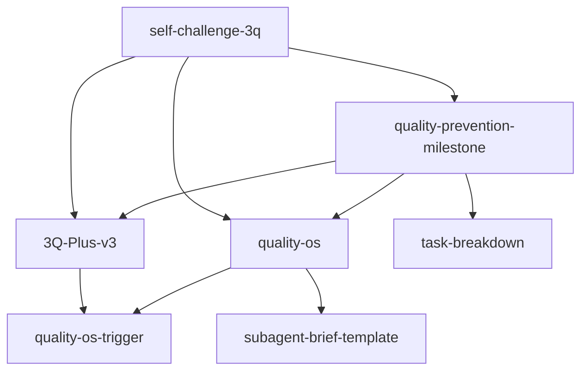

# 3Q 技能体系 v3.0

**最后更新**: 2026-03-28  
**技能总数**: 6 个  
**定位**: DivePast 质量保障体系的核心元技能

---

## 🗺️ 技能体系全景图

```
                    ┌─────────────────┐
                    │  quality-os     │
                    │  (操作系统)     │
                    └────────┬────────┘
                              │
                    ┌────────┴────────┐
                    │ quality-os-     │
                    │ trigger         │
                    │ (触发器)        │
                    └────────┬────────┘
                              │
        ┌─────────────────────┼─────────────────────┐
        │                     │                     │
┌───────┴────────┐  ┌────────┴────────┐  ┌────────┴────────┐
│ 3Q-Plus-v3     │  │ quality-        │  │ quality-        │
│ (增强版)       │  │ prevention-     │  │ dashboard       │
│                │  │ milestone       │  │ (仪表盘)        │
│ 六问框架       │  │ (预防版)        │  │                 │
│ 元认知增强     │  │ 三阶段预防      │  │                 │
└───────┬────────┘  └────────┬────────┘  └─────────────────┘
        │                     │
        └──────────┬──────────┘
                   │
          ┌────────┴────────┐
          │ self-challenge- │
          │ 3q              │
          │ (基础版)        │
          │                 │
          │ 三问框架        │
          │ 15 分制评分     │
          └─────────────────┘
```

---

## 📊 技能详情

### 1. self-challenge-3q（基础版）⭐⭐⭐

**定位**: 3Q 技能体系的基础，提供经典三问框架

**核心能力**:
- 逻辑 Q - 论证是否自洽
- 用户 Q - 用户价值是否清晰
- 竞争 Q - 是否有差异化

**适用场景**:
- 文档发布前质量检查
- 内容创作后的自我挑战
- 方案决策前的 3Q 验证
- 每日进化报告撰写

**依赖关系**: 无（基础技能）

**被依赖**: 3Q-Plus-v3, quality-prevention-milestone, task-breakdown, decision-checklist

**触发词**: "3Q 检查", "self-challenge", "质量评分", "逻辑问用户问竞争问"

**质量评分**: 14/15（A 级）

---

### 2. 3Q-Plus-v3（增强版）⭐⭐⭐

**定位**: 元认知增强版 3Q，用于重要交付物的系统性质量检查

**核心能力**:
- 元认知 Q - 检查"我对任务的理解是否正确"
- 标杆 Q - 对标领域前 1% 最佳实践
- 挑战 Q - 主动寻找最强反对意见
- 逻辑 Q/用户 Q/竞争 Q（继承自基础版）

**适用场景**:
- 重要文档完成后（PRD/技能文档/学习笔记）
- 技能交付前
- 项目里程碑节点
- 需要突破自我视角局限

**依赖关系**: self-challenge-3q, quality-prevention-milestone

**被依赖**: quality-os, quality-os-trigger

**触发词**: "3Q 检查", "质量评分", "元认知检查", "六问框架", "3Q Plus"

**质量评分**: 15/15（S 级）

---

### 3. quality-prevention-milestone（预防版）⭐⭐⭐

**定位**: 质量左移，三阶段预防体系

**核心能力**:
- 事前 3Q - 任务开始前的质量规划
- 事中 13 检查点 - 执行过程中的质量检查
- 事后 3Q - 交付后的质量验收

**适用场景**:
- 项目里程碑节点
- 重要文档发布前
- 代码上线前质量检查
- 任务完成后的质量验收

**依赖关系**: self-challenge-3q, task-breakdown

**被依赖**: 3Q-Plus-v3, quality-os, quality-os-trigger

**触发词**: "质量检查", "质量预防", "milestone 检查", "事前事中事后"

**质量评分**: 15/15（S 级）

---

### 4. quality-os（操作系统）⭐⭐

**定位**: 统一质量操作系统，整合所有质量相关技能

**核心能力**:
- Task 模块 - 任务质量管理
- Quality 模块 - 质量检查流程
- Decision 模块 - 决策质量
- Output 模块 - 交付物质量
- Knowledge 模块 - 知识质量
- AI 模块 - AI 生成内容质量

**适用场景**:
- 建立项目质量体系
- 定义质量标准
- 质量流程设计
- 质量指标追踪

**依赖关系**: quality-prevention-milestone, self-challenge-3q, subagent-brief-template

**被依赖**: quality-os-trigger

**触发词**: "QualityOS", "质量操作系统", "质量体系"

**质量评分**: 15/15（S 级）

---

### 5. quality-os-trigger（触发器）⭐⭐

**定位**: QualityOS 统一触发入口 + 技能联动机制

**核心能力**:
- 自动触发 - 文档保存/代码提交时自动检查
- 技能联动 - 根据任务类型自动匹配质量技能
- 质量左移 - 事前预防优于事后检查

**适用场景**:
- 文档保存时
- 代码提交时
- 决策开始时
- 子代理创建/交付时
- 内容发布前

**依赖关系**: quality-prevention-milestone, self-challenge-3q, 3Q-Plus-v3

**被依赖**: 无（顶层触发器）

**触发词**: "质量检查", "QualityOS", "质量触发", "自动质量检查"

**质量评分**: 15/15（S 级）

---

### 6. quality-dashboard（仪表盘）⭐

**定位**: 质量指标追踪与可视化

**核心能力**:
- 质量指标收集
- 数据可视化
- 趋势分析
- 质量报告生成

**适用场景**:
- 质量指标追踪
- 质量趋势分析
- 质量报告生成
- 团队质量改进

**依赖关系**: quality-os

**被依赖**: 无

**触发词**: "质量仪表盘", "质量指标", "质量报告"

**质量评分**: 14/15（A 级）

---

## 🔄 依赖关系图



---

## 📋 使用指南

### 场景 1：日常文档检查
```
使用 self-challenge-3q
触发词："3Q 检查"
时间：10-15 分钟
```

### 场景 2：重要交付物检查
```
使用 3Q-Plus-v3
触发词："3Q Plus"
时间：30-45 分钟
```

### 场景 3：项目里程碑
```
使用 quality-prevention-milestone
触发词："milestone 检查"
时间：2-4 小时
```

### 场景 4：自动质量检查
```
使用 quality-os-trigger
触发词："QualityOS"
时间：自动执行
```

---

## 📊 质量评分标准

| 等级 | 分数 | 说明 | 技能数量 |
|------|------|------|----------|
| **S 级** | 15/15 | 元技能，核心中的核心 | 4 个 |
| **A 级** | 14/15 | 重要技能 | 2 个 |
| **B 级** | 13/15 | 一般技能 | 0 个 |

---

## 🚀 下一步优化

### P0（本周）
- [ ] 修复 YAML frontmatter 格式
- [ ] 统一 Overview 和 Capabilities 章节
- [ ] 清理重复的 dependencies 字段

### P1（下周）
- [ ] 补充使用示例
- [ ] 创建 3Q 检查清单模板
- [ ] 优化触发词矩阵

### P2（下月）
- [ ] 质量仪表盘开发
- [ ] 自动触发机制优化
- [ ] 质量指标体系建立

---

**维护者**: 小鑫 🔮  
**最后更新**: 2026-03-28  
**下次审查**: 2026-04-04
